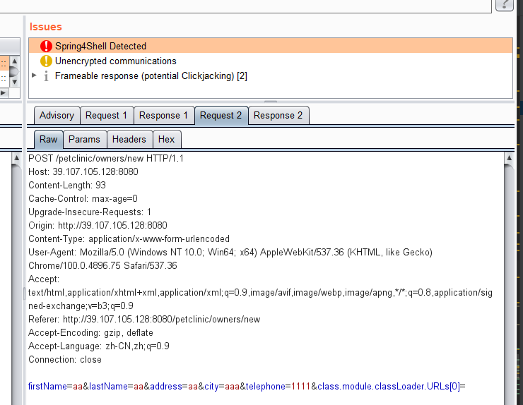

# Spring4ShellScan
一个Spring4Shell【CVE-2022-22965】 被动式检测的Burp插件。

为什么需要造这个轮子？？因为这个漏洞黑盒较难发现，没有具体的业务路径，有了路径没有其他的参数都有可能难以触发到。

## 检测理论依据

在参数的KEY中插入以下2个POC时，会触发业务行为不一致。
通常来说：
class.module.classLoader.URLs[a0]=  ,抛出500异常
class.module.classLoader.URLs[0]= ，不会抛出500异常，和上面的请求返回行为极有可能是不一致的。

## 实现思路：

给所有Body，URL的参数中以这2个POC，多插入一个KEY，判断两个POC插入后返回的请求响应码 和 返回内容是不是一致。如果不一致，则抛出告警。【todo: 还可以在返回500时，对内容进行关键字匹配】

## yakit的靶机测试
感谢yakit的靶机, 地址来源于：
https://github.com/yaklang/yakit-store/blob/master/yak_mitm/cve-2022-22965-spring-core-rce-lt-jdk9/yak_mitm.yak



## 关于误报漏报

目前测试是发现有误报的，因为判断条件是这样的：
两次的响应码不同并且 响应内容不同就认为存在漏洞
```
 if (status_code != req1_statuscode && !responseBody.equals(req1_body)){ // 判断是否存在漏洞
                            hasIssue = true;
                    }
```

漏报情况：
    触发了被动式测试，基于这个判断条件，在Spring + JDK 9.0以上 + Tomcat 应该是没有漏报
